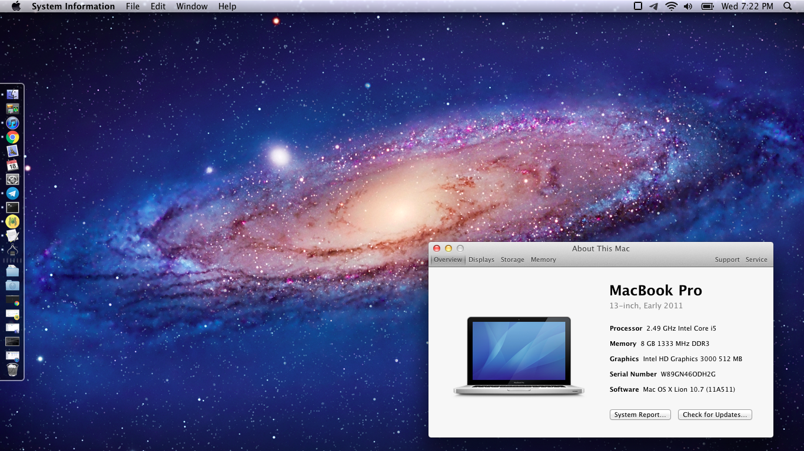

# x220-lion-efi
Running OS X 10.7 on the X220

## Best OS X version
10.7/10

## Installation
Make the media GPT, install the thing, that's it.

## Post-installation
Nothing.

## Screenshot
Sure thing.

## Is that fucking Clover 5070?
Yes.

## Any issues?
Booting up will most likely take 2-7 tries as kernel panics are random. After sleep, all USB drivers are disabled. Also battery sometimes works, sometimes doesn't.
